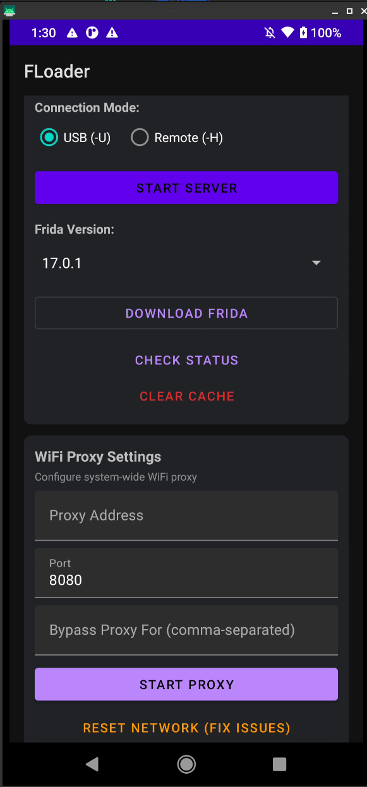

# FLoader

A root Android application for managing Frida server on rooted devices.

## Screenshots

<p align="center">
  
</p>

## Features

- Download Frida server directly from GitHub releases
- Support for multiple Frida versions (17.x, 16.x, 15.x)
- Automatic architecture detection (arm64, arm, x86_64, x86)
- Binary name randomization for anti-detection
- USB and Remote connection modes
- Random port generation for remote mode
- Local version caching
- **Transparent Proxy Settings**:
  - Redirect TCP (HTTP/HTTPS) to proxy with `iptables`
  - Block UDP (QUIC) to force TCP fallback (bypass SSL pinning on some apps)
  - Block IPv6 support
  - **Granular Transparent Proxy Control**: Redirect TCP, Block UDP (QUIC), Block IPv6
- **Library Analysis**: Detect app technologies
- Dark theme UI

## Requirements
- Rooted Android device
- Android 7.0+ (API 24+)
- Magisk or similar root solution

## Usage
1. Launch the app
2. Choose binary naming option (random recommended for anti-detection)
3. Select Frida version from dropdown
4. Click "Check & Download Frida" to download
5. Click "Start Server" to run Frida server
6. **IMPORTANT for spawn mode (-f flag):** After first start, **reboot your device** to apply USAP settings

## Troubleshooting
### "Failed to spawn: unexpectedly timed out" Error
If you get timeout errors when using Frida with `-f` (spawn mode):

**CRITICAL: The app automatically disables USAP when starting Frida server, but you MUST REBOOT your device for the settings to take effect!**

**Steps:**
1. Start Frida server from the app (first time)
2. **Reboot your device** 
3. Start Frida server again after reboot
4. Now spawn mode will work: `frida -U -f com.package.name`

**Verify USAP is disabled** (after reboot):
```bash
adb shell getprop persist.device_config.runtime_native.usap_pool_enabled
# Should return: false
```

If still having issues:

1. **Verify USAP settings persisted**:
   ```bash
   adb shell getprop persist.device_config.runtime_native.usap_pool_enabled
   adb shell getprop persist.device_config.runtime_native.usap_pool_size_max
   # Should return: false and 0
   ```

2. **Check version compatibility**: Make sure PC frida-tools version matches the server version
   ```bash
   frida --version  # Check PC version
   # Should match the version you downloaded in the app
   ```

3. **Verify server is running**: Use "Check Status" button in the app

4. **Try SELinux permissive mode**: Some devices need SELinux in permissive mode
   ```bash
   adb shell su -c setenforce 0
   ```

5. **Restart Frida server**: Stop and start the server again from the app

6. **Check logs**: Long press on "Status" text in the app to see debug info

## Build

```
./gradlew assembleDebug
```

## Changelog

### v1.2.0 (2026-02-01)
- **New Feature**: Granular Transparent Proxy Control
  - **Redirect TCP**: Redirect HTTP/HTTPS traffic to proxy via iptables
  - **Block UDP**: Block UDP 80/443 (QUIC) to force TCP fallback (Essential for Flutter)
  - **Block IPv6**: Block IPv6 traffic
- **Refactor**: Major Cleanup - Focus on Analysis & Utility
  - Removed static APK patching features
  - Enhanced "Library Check" with Flutter detection and reFlutter recommendation
  - Codebase cleanup for stability

### v1.1.0 (2026-01-29)
- **New Feature**: WiFi Proxy Settings
  - Configure system-wide WiFi proxy directly from the app
  - Set proxy address, port, and bypass list
  - Apply/Clear proxy with one tap (requires root)
  - Automatic proxy status detection

### v1.0.1 (2026-01-29)
- **Bug Fix**: Fixed "download failed" error when selecting certain Frida versions
  - Improved version fetching logic to search through more GitHub releases
  - Now fetches up to 500 releases instead of just 30 to find requested versions
  - Added better error messages showing how many releases were searched